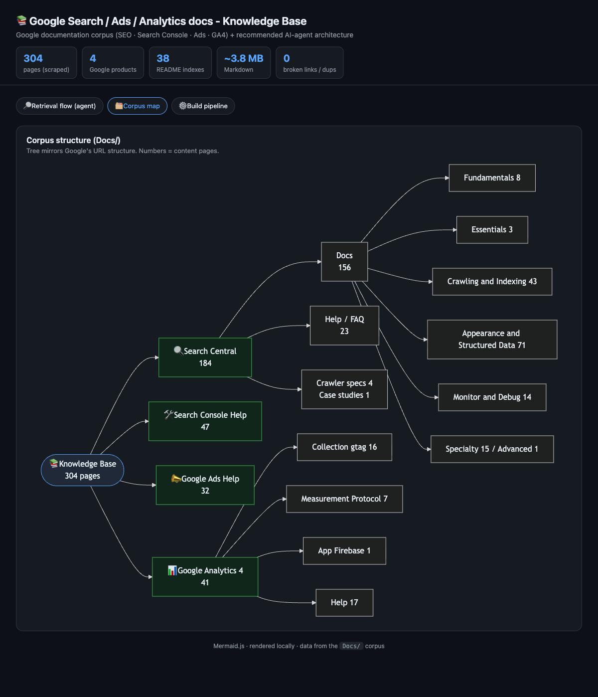
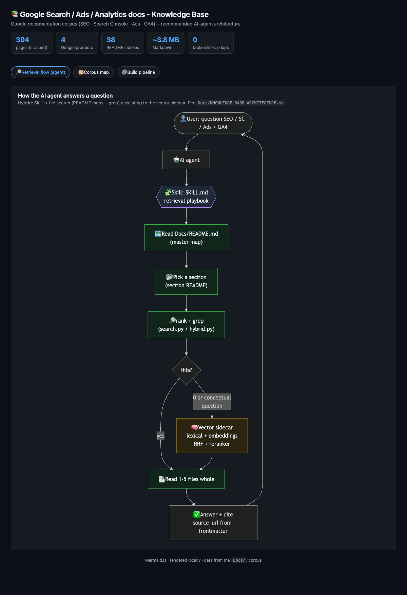

# Google Search / Ads / Analytics - Knowledge Base + Agent Skills

> A curated, validated local corpus of **official Google documentation** for
> **Search/SEO, Search Console, Google Ads, and Google Analytics 4** - plus two
> [Claude Code](https://claude.com/claude-code) **skills**, two slash **commands**, and two
> multi-agent **workflows** that turn it into an AI-agent capability: **cited retrieval**
> and a **multi-agent SEO audit**.


## Install (one line, in Claude Code)

```
/plugin marketplace add bsisduck/google-search-ads-analytics-docs
```
then `/plugin install google-search-ads-analytics@bsisduck` - the skills, `/seo-audit` and
`/google-docs` commands, and the workflows are now available.

The corpus mirrors Google's own URL structure, carries YAML frontmatter with the original
`source_url` on every page, and is validated (0 broken links, 0 duplicates, 0 error pages).
The skills retrieve from it and **answer with citations back to the official Google page** -
so an agent never has to guess about SEO, indexing, structured data, Search Console reports,
Ads conversions, or GA4 measurement.

> **Not affiliated with Google.** The pages under `Docs/` are a local reference copy of
> official Google documentation, (c) Google, licensed [CC BY 4.0](https://creativecommons.org/licenses/by/4.0/).
> All tooling/code is MIT.

---

## Why this exists

LLMs hallucinate Google's rules - the exact `meta robots` syntax, which JSON-LD props are
required for a rich result, what a Search Console report column means. This repo grounds an
agent in the **real docs**: ~1.3M tokens of reference content, too big for one context window
but perfectly sized for **agentic file search** (locate 1-5 pages, read them whole, cite the
source). A semantic vector sidecar covers conceptual / paraphrased queries where lexical
search underperforms.

## What's inside

| Path | What |
|---|---|
| [`Docs/`](Docs/README.md) | **304** Google doc pages (Markdown): Search Central (184), Search Console (47), GA4 (41), Google Ads (32). URL-mirrored tree + 38 section indexes. |
| [`Docs/KNOWLEDGE-BASE-ARCHITECTURE.md`](Docs/KNOWLEDGE-BASE-ARCHITECTURE.md) | Decision record: how to map a corpus this size for an AI agent (file-search + Skill + vector sidecar), web-grounded. |
| `.claude/skills/google-search-ads-analytics-docs/` | **Skill** - cited retrieval over `Docs/`. Lexical (`search.py`, stem-aware, stdlib) + semantic (`vec_search.py`) + hybrid RRF (`hybrid.py`). |
| `.claude/skills/google-seo-audit/` | **Skill** - multi-agent SEO/discoverability audit of a page (live URL or local `.html`), grounded in the docs skill, producing a scored, cited report. |
| `.claude/workflows/` | **Workflows** - `seo-audit.js` (snapshot -> verify per dimension -> adversarial refute -> synthesize) and `docs-research.js` (decompose -> retrieve -> verify claims -> synthesize). |
| `commands/` | **Slash commands** - `/seo-audit [url]` and `/google-docs [question]`. |
| `app/` | Web visualizer (Mermaid) of the corpus + retrieval architecture. |
| `scripts/` | Reproducible pipeline: scrape -> frontmatter -> index -> embeddings -> validate. |
| `data/` | Evaluation query sets (Polish + English cross-lingual). |
| `AUDIT-app-index.md` | Example `google-seo-audit` output (audit of `app/index.html`). |

<p align="center">
  
  
</p>

## Quick start (from a clone)

**Zero-install lexical search** (stdlib only - works immediately):

```bash
python3 .claude/skills/google-search-ads-analytics-docs/search.py "block a page from indexing" --no-content
```

**Full setup** (semantic + hybrid retrieval, model daemon, the audit scanner):

```bash
./setup.sh                 # creates .venv and installs scrapling + sentence-transformers
```

**Install the skills globally for Claude Code** (alternative to the plugin, points at this clone):

```bash
./install-skills.sh        # copies skills to ~/.claude/skills, wires the corpus path
```

In Claude Code, the skills auto-trigger:
- ask *"how do I block a page from indexing?"* -> **google-search-ads-analytics-docs**
- ask *"audit app/index.html for SEO"* -> **google-seo-audit**

## Using it

### Retrieval (CLI)

```bash
# hybrid (best quality - lexical + dense, RRF-fused). Needs ./setup.sh
.venv/bin/python3 .claude/skills/google-search-ads-analytics-docs/hybrid.py "product structured data with price and rating"

# lexical only (no deps, ~0.4s, stem-aware ranking)
python3 .claude/skills/google-search-ads-analytics-docs/search.py "google ads conversion tracking" --top 5

# semantic only (paraphrase / conceptual queries)
.venv/bin/python3 .claude/skills/google-search-ads-analytics-docs/vec_search.py "make my products show up in search results"
```

Each result includes `title`, `source_url`, `section`, and a snippet. The agent reads the
matched files whole and cites the `source_url`. The corpus is **English** (scraped from
Google's `hl=en` pages).

**Speed:** start the model daemon once and hybrid/semantic queries drop to sub-second:

```bash
.venv/bin/python3 scripts/serve_models.py     # leave running
```

### SEO audit

```bash
# snapshot a page (live URL or local file)
.venv/bin/python3 .claude/skills/google-seo-audit/fetch_page.py https://example.com/ --out /tmp/snap.json
```

In Claude Code, run `/seo-audit <url-or-path>` (or the **google-seo-audit** skill). It fans out
one subagent per dimension (crawlability, on-page, structured data, page experience,
international, tagging), grounds each in the docs skill, and writes a scored `AUDIT-<page>.md`
with prioritized, cited fixes.
> Only audit pages you own or are authorized to test.

## Multi-agent workflows

Two reusable [Workflow](https://docs.claude.com/en/docs/claude-code) scripts in `.claude/workflows/`
encode Anthropic's orchestration best practices (pipeline fan-out, adversarial verification,
synthesis) and **scale agents to the work - no fixed cap**:

- **`seo-audit`** - Snapshot -> **Verify** (one agent per SEO dimension) -> **Refute**
  (adversarial verifiers per finding; false positives dropped) -> **Synthesize** a scored,
  cited `AUDIT-<page>.md`. Args: a URL or local path; optional `{ refuters: N }`.
- **`docs-research`** - Decompose a question -> hybrid-retrieve and read per sub-question ->
  **Verify** each claim against its cited `source_url` -> Synthesize one cited answer.

## Retrieval architecture

Three composable paths (see [`KNOWLEDGE-BASE-ARCHITECTURE.md`](Docs/KNOWLEDGE-BASE-ARCHITECTURE.md)):

1. **Lexical** (`search.py`) - frontmatter-aware ranking over the English corpus, stdlib, instant.
2. **Dense** (`vec_search.py`) - `multilingual-e5-small` embeddings over **4,898 contextual
   chunks** (each chunk prepends `title | section`, per [Contextual Retrieval](https://www.anthropic.com/news/contextual-retrieval)).
3. **Hybrid** (`hybrid.py`) - Reciprocal Rank Fusion of lexical + dense. **Default best path.**

**Measured** (`scripts/eval_retrieval.py`): English **92% recall@5** (MRR 0.84, hybrid);
Polish->English cross-lingual **76%**. A cross-encoder reranker is available (`--rerank`) but
is **opt-in**. Run `eval_retrieval.py --file data/eval_queries_en.json` to reproduce.

## Maintenance - reproducible pipeline

| Script | Purpose |
|---|---|
| `scripts/scrape.py [--force] [--only X]` | (Re)scrape pages from `scripts/manifest.json` into `Docs/`. |
| `scripts/enhance_frontmatter.py` | Add YAML frontmatter + strip residual chrome (idempotent). |
| `scripts/build_index.py` | Rebuild the lexical `index.json`. |
| `scripts/build_embeddings.py` | Rebuild the semantic vector index (`vec/`). |
| `scripts/validate.py` | Integrity gate: links, duplicates, error pages, tiny files (non-zero exit on failure). |
| `scripts/refresh.py` | Full refresh: scrape -> frontmatter -> index -> embeddings -> validate. |
| `scripts/eval_retrieval.py` | Recall@k / MRR across methods; `--file data/eval_queries_en.json` for cross-lingual. |

## Licensing

- **Code** (`scripts/`, `.claude/`, `app/`, `commands/`, the `*.py`/`*.sh`/`*.js`) - **MIT** (see [LICENSE](LICENSE)).
- **`Docs/`** - official Google documentation, **(c) Google, [CC BY 4.0](https://creativecommons.org/licenses/by/4.0/)**, retained here as a local reference copy. This project is unofficial and not endorsed by Google.

## Contributing

See [CONTRIBUTING.md](CONTRIBUTING.md). In short: keep the corpus reproducible (edit
`scripts/manifest.json`, not files by hand), run `scripts/validate.py` before a PR, and don't
commit secrets or machine-specific paths.
